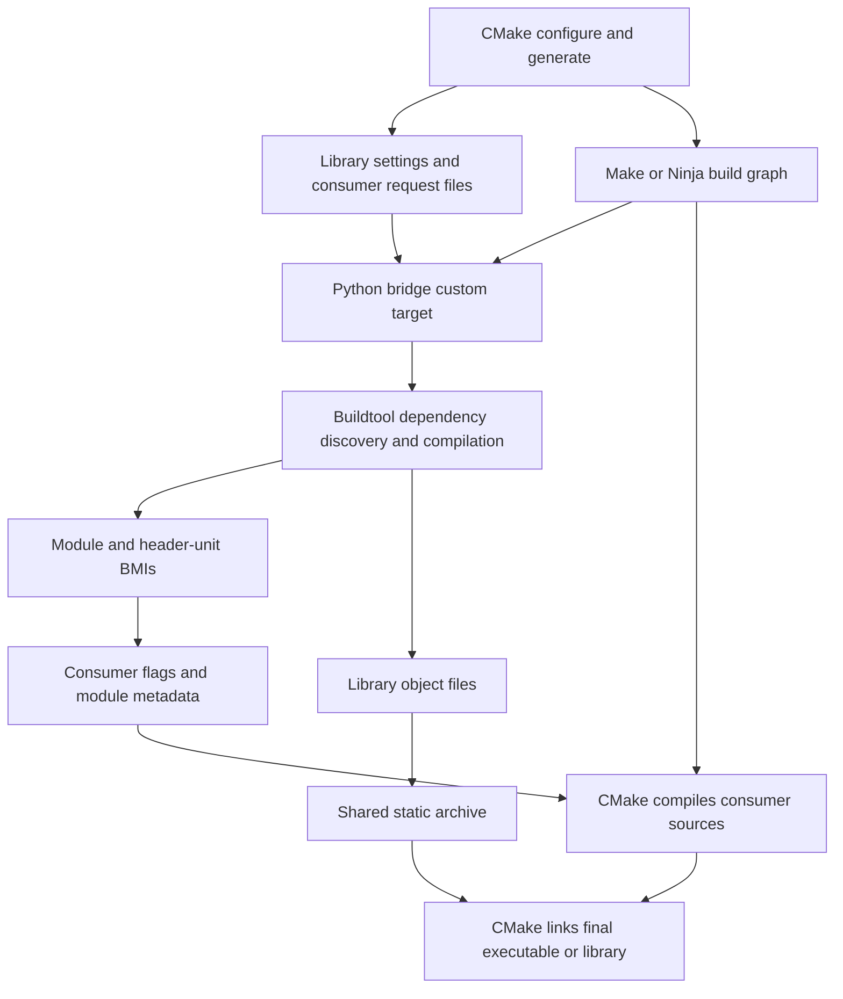

# CMake module bridge walkthrough at b7c6621

This document describes **commit `b7c6621db597736895bae682f20304bc668bafba`**, titled
“Integrate CMake module consumers with shared library builds and jobserver
scheduling.” It was written by reading that revision with `git show`, not by
treating the current working tree as the implementation.

Source links below navigate to repository files. To read their historical
contents, use, for example:

```sh
git show b7c6621db597736895bae682f20304bc668bafba:cmake/Modules.cmake
git show b7c6621db597736895bae682f20304bc668bafba:cmake_modules.py
```

The distinction matters. This commit loads Python when the bridge is included,
expects callers to include the bridge explicitly, and prints the older
`Concurrency:` / `BUILDING` messages. Later work changed those details. This
walkthrough also does not assume the later baselib module rename or the later
ROS workspace integration.

## 1. What the bridge divides between the two build systems

Buildtool compiles a requested library's modules and the source dependencies it
discovers. CMake's generated build system compiles the consumer's ordinary
sources and performs the consumer's final link.

For example, a CMake executable may contain:

```cpp
import lib.async;
// Code using the imported API follows.
```

The executable's `main.cc` is still compiled by a compiler command generated by
CMake. The bridge arranges for `lib.async` to exist before that command runs and
gives the command enough information to import it.

There are two outputs to distinguish:

| Artifact | Purpose |
| --- | --- |
| BMI/CMI, stored with a `.pcm` suffix here | Lets a compiler understand declarations and definitions in an imported module. These are GCC artifacts despite the filename suffix. |
| Object files collected into `libmodules.a` | Supply machine code to the final link. |

Providing a module map without the archive would not supply the library's
out-of-line definitions at link time. Providing only the archive would not make
`import lib.async;` compilable.



This is not an exporter of one CMake compile rule for every baselib source.
The generated build graph contains a coarse buildtool job; buildtool discovers
and schedules the individual library compilations inside that job.

## 2. The entry point and public CMake API

[Buildtool.cmake](Buildtool.cmake) contains only three lines at this commit:

```cmake
include_guard(GLOBAL)
find_package(Python3 3.10 REQUIRED COMPONENTS Interpreter)
include("${CMAKE_CURRENT_LIST_DIR}/Modules.cmake")
```

It prevents repeated initialization, finds the Python interpreter, and defines
the functions implemented in [Modules.cmake](Modules.cmake).

A representative setup is:

```cmake
cmake_minimum_required(VERSION 3.30)
project(example LANGUAGES CXX)
include(/path/to/buildtool/cmake/Buildtool.cmake)

# Supplying library configuration:
buildtool_register_project(baselib SOURCE_ROOT /path/to/baselib)
add_library(baselib::baselib ALIAS baselib)
target_compile_features(baselib PUBLIC cxx_std_23)

# Consumer configuration:
add_executable(hello main.cc)
buildtool_target_modules(hello PRIVATE
  LIBRARY baselib::baselib
  MODULES lib.async)
```

The supplying project also declares whatever conventional CMake dependencies
its modules require, using `target_link_libraries` and normal usage requirements.
The example above shows the bridge wiring, not a complete list of baselib's
external dependencies.

The two functions have different jobs:

| Function | Inputs | Effect |
| --- | --- | --- |
| `buildtool_register_project` | Target name and `SOURCE_ROOT` | Registers a library's settings and source root without enumerating its modules. |
| `buildtool_target_modules` | Existing consumer, `PRIVATE` or `PUBLIC`, registered `LIBRARY`, requested `MODULES`, optional `NATIVE_MODULES` | Creates the build dependency, archive target, and compiler usage requirements for that consumer. |

`MODULES` lists the roots of the requested dependency graph. It is not an
inventory of every module in the library. Imports discovered during compilation
add the remaining dependencies.

The example committed in `examples/baselib-hello` explicitly includes this bridge,
adds a neighboring baselib checkout, and requests `lib.fmt`. Buildtool obtaining
itself through baselib's CPM dependency is not part of this revision.

## 3. Registering a library creates a settings target

`buildtool_register_project(name SOURCE_ROOT ...)` validates the root and creates:

```cmake
add_library(${name} OBJECT EXCLUDE_FROM_ALL .../Settings.cc)
```

[Settings.cc](Settings.cc) is an empty translation unit. Its role is to give
CMake a real C++ target whose effective compiler configuration can be represented
in the CMake file API. It does not include or compile the library's actual module
sources.

The target receives:

* A public minimum of `cxx_std_20`, which the library may raise.
* Its source root as a public include directory.
* `CXX_SCAN_FOR_MODULES OFF`, since the empty settings source needs no scanning.
* `BUILDTOOL_SOURCE_ROOTS` and `INTERFACE_BUILDTOOL_SOURCE_ROOTS` properties.
* `TRANSITIVE_COMPILE_PROPERTIES BUILDTOOL_SOURCE_ROOTS`, so CMake can evaluate
  registered dependency roots through normal target relationships.

Consequently, ordinary CMake settings can be attached to the library:

```cmake
target_compile_definitions(baselib PRIVATE SOME_IMPLEMENTATION_SETTING=1)
target_compile_features(baselib PUBLIC cxx_std_23)
set_target_properties(baselib PROPERTIES POSITION_INDEPENDENT_CODE ON)
```

Buildtool will obtain the library's resulting settings. A consumer's private
`-O0` or private definition does not alter the library or create a separate
library compilation for that consumer.

`EXCLUDE_FROM_ALL` does not mean the settings target is never built. The bridge
later explicitly depends on it, allowing CMake to build its normal dependencies
before launching the module job.

## 4. CMake writes a small manifest for each registered library

Registration uses `file(GENERATE)` to write configuration-specific fields under:

```text
<top-level-build>/buildtool/libraries/<library>/<configuration>/
```

The configuration might be `Debug`, `Release`, or a custom configuration. For a
single-config build with an empty `CMAKE_BUILD_TYPE`, that component is empty.

| File | Contents |
| --- | --- |
| `name` | Registered CMake target name. |
| `root` | Library's own absolute source root. |
| `roots` | Evaluated source-root list, including registered dependencies. |
| `compiler` | `CMAKE_CXX_COMPILER`. |
| `compiler_arg1` | Additional initial compiler argument, if configured. |
| `archiver`, `ranlib` | CMake's selected archive tools. |
| `reply_directory` | Location of CMake's file API replies. |
| `configuration` | Selected build configuration. |

These are simple newline-separated files, not one large JSON configuration.
`$<CONFIG>` and target-property generator expressions are evaluated during
generation, which lets the same configured multi-config build contain separate
settings for each configuration.

Registration also requests codemodel version 2 through:

```cmake
cmake_file_api(QUERY API_VERSION 1 CODEMODEL 2)
```

The manifest identifies the library and tools. The codemodel supplies the
fully evaluated target settings; Python does not attempt to interpret CMake
generator expressions itself.

## 5. Attaching a module bundle to the consumer

`buildtool_target_modules` first checks that:

* CMake is at least 3.30.
* The compiler is GCC, the platform is not Windows, and this is not a cross build.
* The consumer is an ordinary executable, static library, shared library, or
  module-library target, not an alias or imported target.
* The supplying library was registered through the bridge.
* The call has exactly one visibility choice and a nonempty module request.
* This consumer has not already received another bridge call.

For `hello`, it creates a globally visible imported static-library target named:

```text
hello_buildtool_modules
```

Its imported location is the future `libmodules.a`. Its usage requirements include:

```cmake
INTERFACE_COMPILE_OPTIONS
  "$<$<COMPILE_LANGUAGE:CXX>:@.../consumer.rsp>"
INTERFACE_LINK_LIBRARIES
  baselib::baselib
```

Linking this imported target into `hello` therefore adds both the archive and the
response-file argument. It also carries the supplying library's normal public
requirements, such as include paths, C++ minimum, and external libraries.

`PRIVATE` limits propagation of the bundle's compile requirements through the
consumer; `PUBLIC` makes those requirements available to downstream consumers
as well. Ordinary CMake link dependency rules still govern final linking.

The `INTERFACE_BUILDTOOL_BUNDLE` / `COMPATIBLE_INTERFACE_STRING` properties reject
a consumer that inherits incompatible public bundles. GCC gets one selected
mapper; silently combining two unrelated response files would be incorrect.
Separate libraries can privately use separate bundles without exposing both
sets of compile flags to the final executable.

For multi-config generators, the imported archive location is set separately
with `IMPORTED_LOCATION_<CONFIG>`. The implementation does not put an unresolved
generator expression into the imported location property.

## 6. Selecting standalone or native consumer mode

The choice is made when `buildtool_target_modules` runs:

| Condition | Selected mode |
| --- | --- |
| Explicit `NATIVE_MODULES` | Native. |
| Consumer's `CXX_SCAN_FOR_MODULES` is true | Native. |
| Consumer already has a `CXX_MODULES` file set | Native. |
| None of the above | Standalone. |

An unset scanning property is not treated as proof that the project uses native
modules. A module file set selects native mode even if the scanning property is
false. Declare these settings before calling the helper.

Native mode requires Ninja or Ninja Multi-Config in this bridge. Selecting it
with Unix Makefiles produces a configuration error. The helper then explicitly
sets the consumer's `CXX_SCAN_FOR_MODULES` property to the selected mode.

The mode changes how **the consumer** receives module mappings and dependency
information. Both modes use the same buildtool library compilation and can
reuse the same library artifacts.

## 7. The generated custom target is the build-time entry point

Each consumer has its own directory:

```text
<consumer-binary-dir>/buildtool/hello_buildtool_modules/<configuration>/
```

CMake writes the requested module names, consumer name, supplying library
manifest directory, registry directory, configuration, file API reply directory,
and mode into that directory.

It creates a custom target named `hello_buildtool_modules_build` whose command is
equivalent to:

```sh
python3 /path/to/buildtool/cmake_modules.py /path/to/consumer-manifest-directory
```

The command uses the Python interpreter found by `Buildtool.cmake`. At this
revision that interpreter variable is established in the scope where the bridge
is included; the code does not yet perform Python discovery inside the consumer
helper. This is relevant when moving bridge initialization into a dependency's
subdirectory.

The custom target declares its archive, response file, state header, provider
manifest, and mode-specific mapping metadata as `BYPRODUCTS`. It is marked
`JOB_SERVER_AWARE TRUE`.

Dependencies order the work as follows:

```text
supplying library's ordinary CMake dependencies / settings target
    -> module-build custom target
        -> consumer compilation
            -> consumer linking
```

Because this is `add_custom_target`, it runs whenever requested by a build; it
is not skipped just because its byproducts exist. Buildtool performs the
incremental checks inside it. This is how an edit to a previously discovered
module can be noticed without asking CMake to enumerate all module sources.

There is no `COMMENT "Building ... modules"` on this custom target at this commit.
That user-facing progress wording belongs to later changes.

## 8. Reading CMake's effective compiler flags

The Python side is [cmake_modules.py](../cmake_modules.py).

`cmake_targets(directory)` selects the latest file API index, loads its codemodel,
selects the named configuration, and loads that configuration's target records.

`compilation_group(directory)` finds the registered library's C++ compile group.
It requires exactly one such group and rejects precompiled headers. This is why
the registration target contains one empty source and must not be populated
with arbitrary real sources and source-specific settings.

`compiler_flags(directory)` obtains:

* Defines, emitted as `-D...`.
* Include directories, preserving `-I` versus `-isystem` classification.
* Compiler command fragments, including evaluated optimization, debug, PIC, and
  language-standard flags.
* `CMAKE_CXX_COMPILER_ARG1`, when present.

This preserves build-wide settings such as `CMAKE_CXX_FLAGS_RELEASE` and standards
raised by transitive compile features. The bridge does not copy private flags
from the consumer into the supplying library.

Buildtool runs from a different working directory than CMake's compiler command.
`absolute_file_flags` therefore rebases supported relative file options, including
`-include`, `-imacros`, include directories, sysroots, and tool search paths.
Library compiler response-file arguments and LTO flags are rejected rather than
silently interpreted incorrectly.

## 9. Discovering registered dependencies and acquiring locks

`build_modules(directory)` first builds a registry of source roots belonging to
current CMake targets. Duplicate ownership of one root is an error.

Starting at the requested library, it follows the generated `roots` fields to
find all registered libraries that might participate. This is a graph of
registered projects, before the exact source import closure has been compiled.

It acquires an exclusive `flock` on each active library's:

```text
buildtool/libraries/<library>/<configuration>/build.lock
```

`lock_files` canonicalizes paths, deduplicates them, and acquires them in sorted
order. The locks remain held through compilation, archive creation, and
publication of consumer metadata.

Suppose two consumers concurrently request serialrpc modules, and serialrpc has
a registered dependency on baselib. Both jobs may touch the same baselib objects.
Locking the entire registered dependency set prevents simultaneous writes to
those objects. Acquiring the set in the same order prevents one job holding A
while waiting for B and another holding B while waiting for A.

This is conservative: even an unused registered dependency can be locked. The
code does not incrementally acquire new library locks as GCC discovers imports.
Unrelated library sets can proceed concurrently.

The critical ordering is **lock, then read cached build state**. A process that
waits for another build must see its completed artifacts when it resumes.
The empty lock files remain on disk; the lock itself is an OS resource released
when its descriptor closes. They are not “build is active” marker files.

Separate top-level CMake build trees, including separate colcon package build
directories, have separate registries, locks, and caches.

## 10. Creating one buildtool configuration per library

After locking, the bridge changes working directory to the common ancestor of
all registered source roots. This keeps project paths stable across requests
that reach a dependency through different consumers.

It creates a `ModuleTarget` and `BuildConfig` for each active library. Important
configuration choices are:

| Setting | Reason |
| --- | --- |
| `CXX` from CMake | Use CMake's selected compiler. |
| `CXXFLAGS=compiler_flags(...)` | Use this library's own evaluated settings. |
| `INCFLAGS=[]`, `LDFLAGS=[]` | Avoid adding buildtool defaults on top of CMake's settings; CMake owns final linking. |
| `OBJDIR=<library>/artifacts` | Share compiled artifacts across consumers of this library/configuration. |
| `DEPDIR=<artifacts>/deps` | Keep dependency outputs in the same library cache. |
| `USE_DIRECTORY_CONFIG=False` | Do not execute project `BUILD.py` files or add their flags. |
| `ABSOLUTE_MODULE_PATHS=True` | Record BMI dependencies that remain valid with another consumer mapper root. |
| `STD_HEADER_UNIT=False` | Disable the special automatic `bits/stdc++.h` aggregation policy; explicit header units remain supported inside the library build. |
| `JOBS=1` initially | Conservative behavior without a usable outer jobserver. |
| `MemoryBudget()` | Apply the normal memory-based concurrency controls. |

The bridge imports buildtool as a Python library. It does not launch the user's
`~/buildtool.py` configuration script or run `bt build` as a subprocess.

## 11. Module discovery, ownership, and implementation companions

`ModuleTarget` subclasses buildtool's ordinary `Target` to adapt source discovery
to registered CMake libraries.

Its `mod2src` restricts named-module lookup to the configured registered roots.
For example, `lib.async` can resolve through normal filename conventions such as
`lib/async.cc`, `lib/async/module.cc`, or `lib/async/async.cc` within those roots.
The bridge does not recursively compile every `.cc` in the library.

`schedule_compilation_job` routes a named module or C++ companion to the
configuration owning its source path. Nested registered roots are considered
most-specific first. Thus a dependency's private compile flags remain its own,
even when another library's compiler discovers it.

Header units retain the importing library's compilation settings. C or assembly
companions are rejected by the bridge; declare those as ordinary CMake dependency
targets instead.

`schedule_sources` attaches the participating library configurations to one
`CompilationGraph`, sharing its scheduler, source-job records, and link events.
`compile_many` schedules the requested roots, runs the graph, and collects the
objects that belong to the discovered closure.

During an actual GCC module compilation, buildtool's existing mapper protocol
handles import requests. If a needed module is not ready, its compilation is
scheduled and the importer waits. Once ready, the mapper supplies its BMI path.
Header units are built through this same existing dependency machinery.

Header processing also discovers matching implementation companions. For
example, a project header named `foo_impl.h` can lead to compilation of
`foo_impl.cc`. The commit keeps this discovery working while disabling `BUILD.py`
configuration. Absolute CMake include paths are tracked as dependencies too.

There are two different mapper arrangements to keep straight:

* **Inside buildtool's library compilation:** the existing live GCC mapper can
  schedule dependencies on demand.
* **Inside a standalone CMake consumer compilation:** only a static mapper file
  is supplied. No process mapper builds new imports for that consumer.

## 12. Why absolute BMI references matter

Buildtool's normal compiler mapper can return paths relative to its module
repository. A CMake consumer may use a different module repository or CMake's
own generated mapper.

With `ABSOLUTE_MODULE_PATHS=True`, `SourceFile.module_mapper_path` returns absolute
paths in GCC mapper responses. This allows a library BMI's references to other
BMIs, including internal header units, to remain loadable when consumed using
another mapper root.

The option is also stored in incremental `.info` metadata and checked when
loading it. Switching path modes invalidates the cached build state instead of
reusing an artifact made under the other convention.

Absolute paths solve reuse within this build tree. They do not make the artifacts
relocatable or installable for arbitrary consumers elsewhere.

## 13. Concurrency uses the parent's advertised jobserver

[jobserver.py](../jobserver.py) reads `MAKEFLAGS` and uses the last
`--jobserver-auth=...` or older `--jobserver-fds=...` authorization.

The bridge supports FIFO transport on POSIX and anonymous pipes through the
Linux `/proc/self/fd` mechanism. For pipes it reopens the read descriptor rather
than simply duplicating it, so making its reads nonblocking does not alter Make's
shared descriptor flags.

With a usable jobserver, the bridge gives the scheduler a CPU-based local ceiling.
The scheduler further caps it by any advertised numeric `-j` value and the memory
budget. The jobserver tokens remain the authority for actual launch permission.
Without a jobserver, or when connecting fails, the bridge uses one compiler.

`JobServer.try_acquire()` uses the recipe's implicit execution slot for the first
active worker. Each additional worker borrows one byte from the jobserver pipe.
`release()` returns borrowed bytes exactly; it never manufactures a token for the
implicit slot.

In [scheduler.py](../scheduler.py), `CompilerSlots.dispatch` grants a slot only
when the local limit, memory check, and jobserver permit it. Token reads are
nonblocking; a denied request is retried by the event loop. Required dependencies
and resumptions get priority over unrelated waiting work.

When a compiler waits for an imported module, `Job.wait_for_dependency` releases
its execution slot and reacquires one before continuing. Otherwise a one-slot
build could have its importer occupy the only slot while the required dependency
waits forever. A suspended compiler process can still consume memory; released
execution slots are not a guarantee that all its memory has been freed.

The default memory estimate is 2 × 1024³ bytes per compiler, displayed as “GB”.
It is a scheduling heuristic, not a hard per-process memory limit.

The custom target's `JOB_SERVER_AWARE TRUE` makes Make pass the required pipe
descriptors. The Python entry point checks Make dry-run, touch, and question
modes because recursive/jobserver-aware recipes may otherwise execute even in
those modes.

For the Ninja build tested by this commit, a pool is enabled at build time with:

```sh
cmake --build build -j8 -- --jobserver-pool
```

That requires a Ninja binary implementing that option; the commit documents a
tested `1.14.0.git` build. Buildtool itself performs no Ninja-version check and
requires no bridge opt-in variable. It joins any supported jobserver advertised
through `MAKEFLAGS`. An ordinary Ninja invocation without an advertised pool
leaves the bridge at one worker.

SIGINT/SIGTERM handling protects token accounting, and compiler cancellation
terminates and reaps subprocesses before jobserver cleanup returns outstanding
tokens. Library locks remain held during that cleanup.

## 14. Creating and sharing the static archive

After successful compilation, `archive_objects` takes the collected non-header
objects. It sorts and deduplicates their paths, then hashes the object-path set
and the selected archive tools to choose a shared archive directory:

```text
<library>/<configuration>/archives/<object-set-key>/
    archive.json
    objects.rsp
    libmodules.a
```

The archive can include objects from registered dependencies reached through the
request, not only objects whose paths are under the root library.

`archive.json` records content hashes of the object files and the archive tools'
timestamps. If those signatures are unchanged and the archive exists, archiving
is skipped. Hashing uses bounded reads rather than loading large artifacts in
one allocation.

When rebuilding is necessary, it creates a temporary archive using `ar qc`, runs
`ranlib`, and replaces the completed archive atomically. The use of quick append
preserves distinct object files that happen to have the same basename; an
archive update operation based on member basename could otherwise replace one
with another.

Each consumer's `libmodules.a` is a relative symlink to this shared archive.
`link_archive` leaves an already-correct symlink unchanged and replaces it
atomically when a different archive is selected.

Two consumers with the same object set and archive tools reuse the same archive
under the same supplying library. Different closures get different archives but
still reuse their common compiled objects and BMIs. This shares compilation
without promising that every request links the identical archive.

## 15. Publishing standalone consumer files

`artifact_manifest` gathers successfully processed sources from the participating
configurations. It describes named modules, their BMI/source paths and imports,
header-unit BMIs, the repository path, and compiler identity.

`publish_consumer_files` writes this as `providers.json`. In standalone mode,
`write_module_map` also writes a GCC tuple-map file resembling:

```text
$root /build/buildtool/libraries/baselib/Debug/artifacts
lib.async /build/buildtool/libraries/baselib/Debug/artifacts/lib.async.pcm
lib.types /build/buildtool/libraries/baselib/Debug/artifacts/lib.types.pcm
```

Actual entries include all built named modules in the closure. Paths may contain
spaces; tuple-map paths use the remainder of each line rather than shell quoting.
Literal newlines cannot be represented and are rejected.

Header entries are deliberately absent from this map. Supplying them can cause
GCC to translate matching textual includes into header-unit imports, changing
macro and preprocessing behavior. Internal header-unit dependencies instead
load using the paths recorded in the library BMIs.

The standalone `consumer.rsp` contains:

```text
-fmodules-ts
-Mno-modules
-fmodule-mapper=/path/to/consumer.modmap
-include
/path/to/state.h
```

The consumer's CMake compiler command uses `@/path/to/consumer.rsp`. GCC enables
modules, reads the static module map, and force-includes the state header.
`-Mno-modules` suppresses GCC's module-specific dependency rules; ordinary header
depfiles still work.

Standalone consumer source files may import named modules provided by this map.
They cannot request new header units on demand with `import <header>;`, and this
mode does not support defining new native module interfaces in the consumer.

## 16. How `state.h` makes incremental consumers work

The generated header looks like:

```cpp
#pragma once
// Module artifacts: <SHA-256 fingerprint>
```

The fingerprint combines serialized provider metadata and the contents of the
named-module and header-unit BMIs. It is not a semantic hash of exported C++ APIs.
An implementation detail that changes BMI bytes can change the fingerprint too.

`write_changed` first compares contents. If identical, it leaves the file and its
timestamp untouched. Otherwise it writes a temporary file and atomically replaces
the destination.

Because GCC force-includes `state.h`, the consumer's ordinary compiler depfile
records it as an input. The buildtool custom target runs first; if it changes
`state.h`, the consumer's object files become out of date for Make or Ninja.

This is intentionally coarse: all sources inheriting a bundle depend on that
bundle's state header, whether or not each source imports every module in it.

If only an implementation companion's object changes, with unchanged BMIs and
provider metadata, the archive is rebuilt but `state.h` can remain unchanged.
The final link must run again, while consumer source compilation can be reused.

## 17. Native CMake integration uses its collator, but still has a state header

In native mode the bridge does not write its own consumer mapper. Its response
file supplies `-fmodules-ts` and the forced `state.h` include, while CMake generates
the consumer's module map through its normal scanning and collation machinery.

`publish_cmake_metadata` constructs a `CXXModules.json` provider file with:

| Field | Meaning in this bridge |
| --- | --- |
| `modules` | Module names mapped to BMI paths and `is-private: false`. |
| `references` | BMI references expressed relative to the top-level build directory, using lookup method `by-name`. |
| `usages` | Each module's transitive named-module imports. |

`module_usages` computes the named import closure and omits header units. Their
internal loading is already represented in the GCC artifacts.

The bridge then examines the codemodel's C++ compile fragments to find every
target inheriting this bundle's `@consumer.rsp`, including downstream public
consumers. For each one it locates the generated `CXXDependInfo.json`, checks the
configuration/language/structure, and adds the provider directory to
`linked-target-dirs` without discarding existing native providers.

It also records a `buildtool-fingerprint` in that file. The returned fingerprint
includes the provider metadata and is used to generate `state.h`.

CMake's collator can now combine these external providers with modules built by
ordinary CMake targets. It generates the compiler `.modmap` and Ninja dynamic
dependency information. A native consumer can therefore import both kinds of
modules, and it can provide its own interfaces through a `CXX_MODULES` file set.

Two qualifications are essential:

1. **This is an internal-metadata integration.** CMake's file API is the public
   mechanism used to read settings, but modifying generated `CXXDependInfo.json`
   and supplying this `CXXModules.json` is not a public external-provider API.
   CMake implementation changes can require bridge changes.
2. **This commit retains `state.h` in native mode.** Native BMI dependencies are
   not its only invalidation mechanism. The state header forces consumer scans
   and collation to rerun when external providers change, including additions or
   removals during the same build. It can therefore still cause bundle-wide
   recompilation, despite native mode having more detailed dependency metadata.

Publication takes a separate `buildtool/metadata.lock` so concurrent bridge jobs
do not overwrite each other's changes to CMake metadata. All needed library
locks are already held; publication does not acquire further library locks while
holding the metadata lock.

The custom target restores its metadata additions on later builds after CMake
regeneration. It does not rewrite `build.ninja` or directly edit CMake's `.modmap`
files. Explicitly disabling scanning on an inheriting native consumer is rejected
when its expected collation metadata cannot be found.

## 18. Incremental builds, cleaning, and failure behavior

The main scenarios are:

| Change | Expected work |
| --- | --- |
| Nothing changed | Custom target checks caches; unchanged archive and published files keep their timestamps. No consumer recompile or relink is needed. |
| Module or tracked header changed | Buildtool rebuilds affected library artifacts; changed fingerprint triggers dependent consumer work. |
| Companion implementation changed, BMI unchanged | Updated object/archive triggers relinking; consumer source recompilation need not occur. |
| Consumer's private source/flags changed | CMake rebuilds that consumer; supplying library compilation remains governed by library settings. |
| Library flags or compiler identity changed | Buildtool's incremental metadata invalidates affected cached library compilation. |
| Requested/imported module set changed | New closure and map/provider metadata are published; native mode also invalidates scanning/collation. |
| CMake clean requested | Registered libraries' artifact and archive directories are removed through `ADDITIONAL_CLEAN_FILES`. |

Library `.info` metadata records compiler command/identity and dependencies.
This commit also records the absolute-module-path mode and includes absolute
header dependencies when directory configuration is disabled. The bridge uses
those existing buildtool checks instead of writing a second incremental compiler.

Cleaning removes objects, BMIs, header units, and `.info` caches along with shared
archives. Library configuration manifests and library lock files are outside
those cache directories. Thus `--clean-first` can force actual library compilation
while preserving the information needed to invoke the bridge again.

Within one buildtool invocation, jobs have separate spooled output streams. The
reporter consumes roots in queue order, streams one job's output, then appends its
discovered children. Compilation may run concurrently; its diagnostic streams
are presented in logical order. A reported failure ends normal reporting and
cancels unfinished work, preserving dependency diagnostics when an importer fails
because its prerequisite did.

At this revision the banner is `Concurrency: ...`, followed by ordinary
`BUILDING ...` lines. Jobserver-controlled output reports an “up to” local ceiling
and a shared-jobserver annotation. Up-to-date invocations omit the concurrency
banner. It does not yet use the later indented CMake-oriented progress format.

This ordering applies inside one buildtool process. The outer Make/Ninja process
still controls how output from different recipes is displayed.

## 19. A complete invocation in pseudocode

```text
CMAKE CONFIGURE / GENERATE:
    include bridge and locate Python
    for each registered library:
        create empty C++ settings target
        publish source-root and compile usage requirements
        generate per-configuration manifest
        request codemodel file API

    for each consumer requesting modules:
        choose standalone/native mode
        create imported archive bundle and usage requirements
        generate request manifest
        create jobserver-aware custom build target
        order library dependencies before it, consumer compilation after it

MAKE / NINJA BUILD:
    build ordinary prerequisite targets
    launch Python bridge for the requested bundle

PYTHON BRIDGE:
    load request and CMake codemodel
    discover registered library dependency set
    acquire all library locks in canonical order
    connect to advertised jobserver, if any
    choose stable working directory
    create one BuildConfig / ModuleTarget per active library
    resolve requested module names to source paths

    BUILD MODULE CLOSURE:
        reuse valid .info/artifacts
        otherwise launch GCC under memory/jobserver limits
        answer GCC mapper requests
        schedule newly discovered imports and companions
        suspend importers' execution slots while they await dependencies
        collect resulting non-header object files

    select or rebuild shared static archive
    publish provider manifest
    if standalone:
        publish static GCC named-module map
    else:
        take metadata lock
        publish CMake providers and amend collation inputs
        release metadata lock
    update state.h only if fingerprint changed
    publish consumer response file
    restore working directory, close jobserver, release library locks

MAKE / NINJA CONTINUES:
    if native: scan/collate consumer module dependencies
    compile out-of-date consumer objects with published flags/mappings
    link executable/library against module archive and ordinary dependencies
```

## 20. What this revision does not implement

The bridge supports native GCC on POSIX with CMake 3.30+ and Python 3.10+.
Its tests require sufficiently recent GCC module support; several fixtures use
C++26 and require GCC 14 or newer.

Important boundaries in this revision are:

* Clang, cross-compilation, and Windows are not supported by this CMake bridge,
  regardless of capabilities elsewhere in buildtool.
* Native metadata integration requires Ninja or Ninja Multi-Config.
* Direct consumer header-unit imports are unsupported in both modes. Internal
  header units built as part of the library closure are supported.
* Buildtool modules cannot import native CMake-built modules through this API.
  The supported mixed dependency direction is from native consumers to buildtool
  providers, alongside other native providers.
* A registered library must have one C++ settings group. Arbitrary per-source
  compile settings, PCH, library compiler response files, and IPO/LTO are not
  supported; several are explicitly rejected.
* C/assembly implementation dependencies must be ordinary CMake targets.
* Module bundles are tied to the build tree. Installation/export and relocation
  are not implemented.
* Consumer compiler, dialect, and ABI options must remain compatible with the
  library's BMIs. Publishing a public minimum C++ standard does not solve all BMI
  compatibility constraints.
* Standalone downstream consumers must keep native module scanning disabled.
  That target property is not propagated by `PUBLIC` response-file options.
* Multiple conflicting public bundles cannot be merged in one consumer.
* Locks serialize overlapping registered library sets. Jobserver integration
  limits concurrency; it does not make those overlapping invocations parallel.

The commit's README states that the real ROS workspace had not yet been switched
to this API. Later ROS configuration and dependency fixes should not be read back
into this historical implementation.

## 21. Where to continue reading and how this was checked

| Source at this commit | Main responsibility |
| --- | --- |
| [cmake/Buildtool.cmake](Buildtool.cmake) | Bridge initialization and Python discovery. |
| [cmake/Modules.cmake](Modules.cmake) | Library registration, consumer mode selection, imported bundles, custom targets, generated fields. |
| [cmake/Settings.cc](Settings.cc) | Empty source used to expose CMake compile settings. |
| [cmake_modules.py](../cmake_modules.py) | Codemodel interpretation, library locks/configurations, module compilation, archive and metadata publication. |
| [buildtool.py](../buildtool.py) | Source discovery, incremental state, GCC mapper protocol, compilation graph and link-input collection. |
| [scheduler.py](../scheduler.py) | Ordered output and compiler slots, including dependency suspension. |
| [compiler.py](../compiler.py) | Compiler subprocess execution, protocol handling, and termination cleanup. |
| [jobserver.py](../jobserver.py) | MAKEFLAGS parsing, FIFO/pipe connection, exact token accounting. |
| [memory.py](../memory.py) | Available-memory checks and estimated compiler limits. |
| [cmake/README.md](README.md) | API examples, supported modes, and limitations recorded with the commit. |

The committed regression coverage includes:

* `tests/test_cmake_bridge.py`: ordinary CMake consumers, registered dependency
  chains, shared artifacts, compiler settings, incremental changes, native versus
  standalone sharing, and conflicting bundle rejection.
* `tests/test_cmake_native_modules.py`: mixed buildtool/native modules under Ninja
  and Ninja Multi-Config, including provider changes and regeneration.
* `tests/test_cmake_locks.py`: overlapping and unrelated builds, cache rechecks
  after locking, failure cleanup, and metadata publication serialization.
* `tests/test_jobserver.py`: token handling, suspended dependencies, cancellation,
  real Make recipes, and optional Ninja pool integration.

The commit also fixes the ordinary buildtool CLI's database refresh calls to pass
the caller's source roots explicitly. That change is covered by
`tests/test_database_refresh.py`; it is separate from the CMake bridge's module
provider publication and does not mean the bridge runs the normal CLI refresh
path.

This walkthrough is a source review, not a fresh test run of the historical
commit. To reproduce its tests without disturbing current edits, use an isolated
checkout of the full commit and run, for example:

```sh
python3 -m unittest discover -s tests -p test_cmake_bridge.py -v
python3 -m unittest discover -s tests -p test_cmake_native_modules.py -v
python3 -m unittest discover -s tests -p test_cmake_locks.py -v
python3 -m unittest discover -s tests -p test_jobserver.py -v
```

For optional Ninja pool tests, set `BT_TEST_NINJA` to a compatible Ninja binary.
The hello example additionally needs a compatible baselib checkout and its
external dependencies; this buildtool commit alone does not pin that entire
environment.
